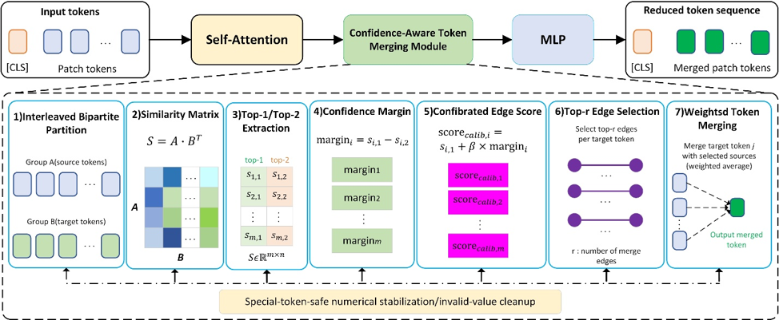

# Reliability-Guided Token Compression for Efficient Transformer-Based Visual Inference

This repository contains the reproducibility code for the manuscript:

**Reliability-Guided Token Compression for Efficient Transformer-Based Visual Inference**



The project studies a training-free reliability-guided refinement for ToMe-style token merging. The method preserves the original bipartite soft matching target assignment and weighted token aggregation, but changes the source-token ranking score by adding a small top-1/top-2 matching-margin term:

```text
calibrated_score = top1_similarity + beta * (top1_similarity - top2_similarity)
```

The margin term is used as a lightweight estimate of merge-edge reliability. A larger margin means that the best target token is more clearly separated from the second-best candidate. The implementation also includes special-token-safe numerical stabilization to avoid invalid scores when protected tokens are excluded from merging.

This repository is intended to make the experimental protocol reusable. It does **not** redistribute datasets, pretrained model weights, generated images, result logs, or paper tables. All generated files should be written to `outputs/`, which is ignored by Git.

## Main functionality

The repository provides code for the following parts of the manuscript.

### 1. ToMe-style reliability-guided token merging package

The `tome/` package contains the core patching utilities used by the experiments. The package name is kept as `tome` for compatibility with the ToMe-style patching interface, while the ranking score implements the reliability-guided calibration used in the manuscript.

Core files:

```text
tome/merge.py          # bipartite matching, weighted merging, calibrated ranking utilities
tome/utils.py          # token merging schedules and helper functions
tome/patch/timm.py     # patching utilities for timm ViT-style models
tome/patch/mae.py      # MAE-style patching utilities
tome/patch/swag.py     # SWAG-style patching utilities
```

### 2. ImageNet-1K classification experiments

Scripts under `experiments/imagenet/` reproduce the main classification protocol and diagnostic analyses:

```text
experiments/imagenet/eval_vit_methods_stable.py          # ViT fixed-beta evaluation and throughput protocol
experiments/imagenet/eval_deit_generality.py             # DeiT-S/16 and DeiT-B/16 fixed-beta and beta-sweep evaluation
experiments/imagenet/bootstrap_vit_paired.py             # paired image-level bootstrap analysis for Top-1 differences
experiments/imagenet/paired_bootstrap_from_npy.py         # bootstrap from saved per-image correctness arrays
experiments/imagenet/benchmark_deit_throughput_stable.py  # repeated model-only throughput measurement
experiments/imagenet/diagnose_deit_small_overhead.py      # DeiT-S/16 overhead diagnostic
experiments/imagenet/diagnose_deit_small_robust_v2.py     # robust repeated throughput diagnostic
```

These scripts are designed to compare the full patched model, similarity-only ToMe, and the proposed reliability-guided ranking under the same merging rate and token schedule.

### 3. Stable Diffusion / ToMeSD-style transfer analysis

Scripts under `experiments/stable_diffusion/` support the Stable Diffusion transfer experiment and paired metric analysis:

```text
experiments/stable_diffusion/sd_experiment_config.py
experiments/stable_diffusion/sd_compare.py
experiments/stable_diffusion/sd_beta_sweep_r05_tiny.py
experiments/stable_diffusion/sd_metrics_r05.py
experiments/stable_diffusion/analyze_sd_pair_wins.py
experiments/stable_diffusion/make_sd_table9_paired_stability.py
```

The generation extension should be interpreted as a ToMeSD-style transferability test. It is not intended to claim a statistically decisive quality improvement over ToMe-SD; it checks whether the same calibrated ranking can be used without noticeable degradation under a fixed merge ratio.

### 4. ADE20K Segmenter-B/16 dense prediction transfer

Scripts under `experiments/dense_prediction/` support the appendix dense prediction experiment:

```text
experiments/dense_prediction/verify_segmenter_baseline.py          # load Segmenter checkpoint and run one forward pass
experiments/dense_prediction/eval_segmenter_baseline_ade20k_v2.py  # reproduce the Segmenter-B/16 ADE20K full baseline
experiments/dense_prediction/eval_segmenter_tome_ours_ade20k.py    # Full / ToMe / Ours transfer evaluation
```

The dense prediction experiment evaluates transferability rather than optimized segmentation acceleration. Segmenter requires restoration of the full spatial patch grid before decoding, so the current merge-unmerge implementation introduces indexing overhead and should not be used as runtime acceleration evidence.

### 5. Figure-generation utilities

Scripts under `experiments/figures/` generate efficiency and diagnostic visualizations used during manuscript preparation:

```text
experiments/figures/plot_efficiency_figs.py
experiments/figures/plot_efficiency_figs_combined.py
experiments/figures/plot_fig6_ranking_diagnostic_4groups.py
```

These scripts expect local experiment outputs and will write generated figures to user-specified paths. The repository does not include generated figures by default.

## Repository structure

```text
Reliability-Guided-Token-Compression/
├── tome/                         # ToMe-style patch package with reliability-guided ranking
├── experiments/
│   ├── imagenet/                 # ImageNet-1K classification, bootstrap, throughput, beta sweep
│   ├── stable_diffusion/          # Stable Diffusion / ToMeSD-style transfer utilities
│   ├── dense_prediction/          # Segmenter-B/16 ADE20K transfer scripts
│   └── figures/                   # Figure-generation scripts
├── docs/                          # Dataset layout, reproducibility notes, GitHub upload notes
├── requirements.txt
├── environment.yml
├── pyproject.toml
├── THIRD_PARTY_NOTICES.md
├── CITATION.cff
└── LICENSE
```

## Installation

A clean environment is recommended.

```bash
conda create -n rgtc python=3.10 -y
conda activate rgtc

# Install a PyTorch build that matches your CUDA driver first.
# Example only; adjust to your machine.
pip install torch torchvision --index-url https://download.pytorch.org/whl/cu118

pip install -r requirements.txt
pip install -e .
```

For dense prediction with Segmenter, the official Segmenter repository must also be installed or placed on `PYTHONPATH`, because the scripts import `segm.model.factory` and `segm.utils.torch`.

## Data and checkpoint layout

This repository does not redistribute ImageNet-1K, ADE20K, Stable Diffusion checkpoints, Segmenter checkpoints, or generated images.

Expected ImageNet validation layout:

```text
/path/to/imagenet/val/
  n01440764/*.JPEG
  n01443537/*.JPEG
  ...
```

Expected ADE20K layout:

```text
/path/to/ADEChallengeData2016/
  images/validation/*.jpg
  annotations/validation/*.png
```

Expected Segmenter checkpoint layout:

```text
/path/to/segmenter/checkpoints/seg_base_mask/
  checkpoint.pth
  variant.yml
```

The ADE20K appendix uses the official Segmenter Seg-B-Mask/16 checkpoint and its accompanying `variant.yml`.

## Example commands

Create an output directory first. It is ignored by Git.

```bash
mkdir -p outputs
```

### Import test

```bash
python -c "import torch, timm, tome; print('torch:', torch.__version__); print('timm:', timm.__version__); print('tome package OK:', tome.__all__)"
```

### DeiT fixed-beta transfer

```bash
python experiments/imagenet/eval_deit_generality.py \
  --imagenet-val /path/to/imagenet/val \
  --models deit_small_patch16_224 deit_base_patch16_224 \
  --r-list 4 8 12 16 20 25 \
  --batch-size 64 \
  --num-workers 6 \
  --throughput-runs 40 \
  --throughput-repeats 1 \
  --device cuda \
  --run-fixed \
  --out-csv outputs/deit_generality_results_full_r.csv
```

### DeiT beta sensitivity

```bash
python experiments/imagenet/eval_deit_generality.py \
  --imagenet-val /path/to/imagenet/val \
  --models deit_small_patch16_224 deit_base_patch16_224 \
  --run-beta-sweep \
  --sweep-r-list 8 12 16 \
  --beta-list 0 0.01 0.035 0.05 0.1 0.2 0.3 \
  --skip-gflops \
  --skip-throughput \
  --sweep-out-csv outputs/deit_beta_sweep_results.csv
```

### Paired bootstrap for ImageNet-1K

```bash
python experiments/imagenet/bootstrap_vit_paired.py \
  --imagenet-val /path/to/imagenet/val \
  --model-name vit_base_patch16_224 \
  --r 12 \
  --beta 0.050 \
  --bootstrap-samples 10000 \
  --out-csv outputs/vit_b_r12_bootstrap.csv
```

### ADE20K Segmenter baseline check

```bash
python experiments/dense_prediction/verify_segmenter_baseline.py \
  --checkpoint /path/to/segmenter/checkpoints/seg_base_mask/checkpoint.pth \
  --device cuda:0 \
  --height 512 \
  --width 512
```

### ADE20K Full / ToMe / Ours dense prediction transfer

```bash
python experiments/dense_prediction/eval_segmenter_tome_ours_ade20k.py \
  --checkpoint /path/to/segmenter/checkpoints/seg_base_mask/checkpoint.pth \
  --ade20k-root /path/to/ADEChallengeData2016 \
  --device cuda:0 \
  --r-list 16 32 48 \
  --beta-map 16:0.015 32:0.035 48:0.050 \
  --window-size 512 \
  --window-stride 480 \
  --window-batch-size 4 \
  --benchmark-batch-size 1 \
  --throughput-warmup 20 \
  --throughput-runs 50 \
  --throughput-repeats 5 \
  --out-csv outputs/segmenter_tome_ours_ade20k_results.csv \
  --out-json outputs/segmenter_tome_ours_ade20k_results.json
```

## Interpretation notes

1. Under the same merging rate, ToMe and the proposed method have the same token schedule and estimated GFLOPs. Their difference comes from source-token edge ranking.
2. GFLOPs-based speedup and measured throughput speedup should be reported separately. Matching, sorting, gather/scatter aggregation, and merge-unmerge operations can introduce runtime overhead not captured by GFLOPs.
3. The DeiT-S/16 throughput behavior should be interpreted as a small-backbone overhead case. The model is already fast, so the saved computation may not dominate token-merging overhead.
4. The ADE20K Segmenter experiment is a dense prediction transferability test. It is not an optimized segmentation acceleration benchmark.
5. Stable Diffusion results should be reported as comparable transferability rather than as a statistically conclusive quality improvement over ToMe-SD.

## Acknowledgements and third-party models

This project builds on several open research resources. We thank the authors and maintainers of the following works and tools:

- **Token Merging (ToMe)** for the bipartite soft matching framework and ToMe-style ViT patching design.
- **ToMe for Stable Diffusion / ToMeSD-style token merging** for the merge-unmerge idea used in diffusion self-attention blocks.
- **Vision Transformer (ViT)** and **DeiT** for the classification backbones used in the ImageNet-1K experiments.
- **timm** for pretrained ViT/DeiT model definitions and model-loading utilities.
- **Stable Diffusion / Latent Diffusion Models** for the text-to-image generation backbone used in the transferability experiment. No Stable Diffusion weights are redistributed in this repository.
- **Segmenter** for the Seg-B-Mask/16 ADE20K semantic segmentation model and configuration used in the dense prediction appendix. No Segmenter checkpoint is redistributed in this repository.
- **PyTorch**, **torchvision**, **NumPy**, **SciPy**, **Pillow**, **tqdm**, **Matplotlib**, **LPIPS**, **MS-SSIM**, and related open-source libraries used for evaluation and analysis.
- **ImageNet-1K** and **ADE20K** for the evaluation datasets. Users must obtain these datasets from their official sources and comply with their licenses and terms of use.

The inclusion of third-party names here is for scholarly acknowledgement and reproducibility only. Users are responsible for following the licenses and usage terms of all datasets, checkpoints, and libraries.

## Citation

If this code is useful, please cite the associated manuscript. A citation template is provided in `CITATION.cff` and should be updated with the final DOI after publication or archival.
